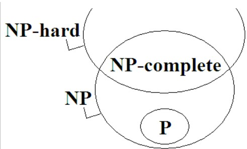

# LIST

* [最短路徑(Floyd-Warshall 演算法)](https://ithelp.ithome.com.tw/articles/10209186)
* [Bellman-Ford, Dijkstra](https://www.itread01.com/content/1549908206.html)
* [Proving set cover Hardness](https://www.geeksforgeeks.org/set-cover-is-np-complete/)

# Graph

### NP,P,NP-Hard,NP-Complete

* P問題是在多項式時間內可以被解決的問題
* NP問題是在多項式時間內可以被驗證其正確性的問題。
* 如果所有NP問題都可以多項式時間歸約到某個問題，則稱該問題為NP困難。
* NP-complete : 它是一個NP問題，其他屬於NP的問題都可在多項式時間內簡化成它。
* 證明是否為NP-HARD: 若要證明Y是NP-hard，假設現在有一個Y的黑盒求解器，於是我們設計一個多項式算法來用Y的求解器來求解問題X。
也就是說，當這個求解器是多項式時間的時候，意味著X也可以多項式求解。那如果我們已經知道X是很難求解，如果X可以reduce到Y，那麼意味著Y跟X一樣難解，因為只有困難的求解器才能解決困難的問題。
而這正是證明問題Y是NP-hard或NP-complete的思路，只要找到一個Np-hard或者NP-complete的問題X可以reduce到Y就可以了。

[P-NP](https://www.baeldung.com/cs/p-np-np-complete-np-hard)
[P-NP2](https://www.geeksforgeeks.org/np-completeness-set-1/)