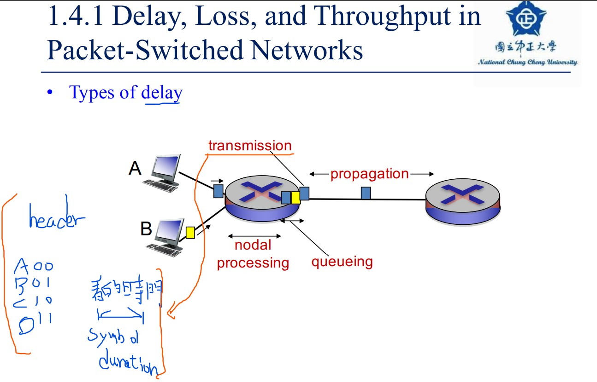

# 電腦網路

https://medium.com/tsungs-blog/day8-%E7%B6%B2%E8%B7%AF%E6%9E%B6%E6%A7%8B%E5%8F%8A%E5%9F%BA%E7%A4%8E%E7%9F%A5%E8%AD%98-2-bcebc24a70b

### 專有名詞
- Internet Service Providers (ISPs)

>Q: 現今多用Circuit Switching or Packet Switching

---

## Delay, Loss, Throughtput

* Processing Delay
解讀packet header並解決定此packetmap到特定link的時間就是process delay，通常在routers裡面，此種delay的時間大概落於microseconds or less

* Queuing Delay
就字面上的意思，當packet 進到queue裡面，等待其他先到達的packet完成傳輸的時間成本就是Queuing Delay，通常此delay的時間實務上落於microseconds to milliseconds。

* Transmission Delay
packet傳輸到link的所耗費時間，假使今天packet有L bits，link的 transmission rate R bits/sec，那麼transmission delay的時間便是 L/R，此delay的時間實務上落於microseconds to milliseconds。

* Propagation Delay
從link將資料傳遞到router的時間成本，Propagation speed主要影響為實體的線路，指的是一個packet從router到router的時間，而影響此數據的實際因素為router間的distance。

[Delay, Loss, Throughtput](https://ithelp.ithome.com.tw/articles/10205005)

---

* Switch：

>中譯：交換器 或是 橋接器(Bridge)

>功能：傳送封包，連接PC

* Router：
>中譯：路由器

>功能：交換不同網段的封包、決定封包的傳送方向及路徑
