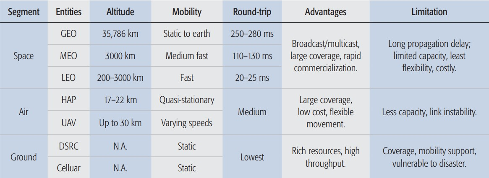
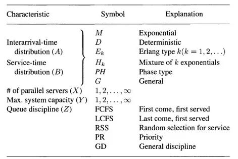

# Learning_web

* 電腦網路 
* 計算方法
* [Internet structure](#Internet_structure)
* [Python section](#Python_section)

## Imitation Learning
* [介绍](https://cloud.tencent.com/developer/article/1144328)

---

## Fog computing & Edge computing

### !!! fog computing can’t replace edge computing. However, edge computing can definitely live without fog computing

### Fog computing
1. efficiency of data traffic and a reduction in latency
2. lower storage need
3. faster data transfer
4. requires an investment. It is a more complex system

### Edge computing

> edge computing happens where data is being generated, right at “the edge” of a given application’s network. This means that an edge computer is connected to the sensors and controllers of a given device and then sends data to the cloud. 

---

## Software Defined Space-Air-Ground Integrated Vehicular Networks

> 各取好處，在都市使用地面網路(RSU)到了不密集的鄉村則善用衛星。

>Ref. Software Defined Space-Air-Ground 
Integrated Vehicular Networks:
Challenges and Solutions

---

## 馬可夫決策過程 Markov Decision Process（MDP）

> 只要是連續決策、而且在決策過程中的行動具有不確定性，就可以用 MDP 來處理。
[!!!連結!!!](https://blog.techbridge.cc/2018/10/27/intro-to-mdp-and-app/)

---
## 卜松過程 (Poisson Process)
>卜松過程是馬可夫過程 (Markov Proscess) 中最簡單的一種
1. [!!!連結!!!](http://episte.math.ntu.edu.tw/articles/mm/mm_02_4_01/index.html)
2. [證明影片](https://www.youtube.com/watch?v=Cd1r98qABl8&t=1s)

---
## 馬可夫鏈（Markov chain）
>一狀態的機率分布只能由當前狀態決定，在時間序列中它前面的事件均與之無關。這種特定類型的「無記憶性」稱作馬可夫性質
[!!!連結!!!](http://episte.math.ntu.edu.tw/articles/mm/mm_09_3_08/page2.html)

---

## Markov-modulated Poisson Process (MMPP)

>Poisson process that has its parameter controlled by a Markov process. These arrival processes are typical in communications modeling where time-varying arrival rates capture some of the important correlations between inter-arrival times. 
[!!!連結!!!](https://www.sfu.ca/sasdoc/sashtml/qsim/chap9/sect7.htm)

* [契約理論（Contract_Theory）](https://wiki.mbalib.com/zh-tw/%E5%A5%91%E7%BA%A6%E7%90%86%E8%AE%BA)
* [前景理論(Prospect_Theory)](https://wiki.mbalib.com/zh-tw/%E5%89%8D%E6%99%AF%E7%90%86%E8%AE%BA)

---

## 排隊理論 (queueing)

### 歷史
>厄朗（英語：Agner Krarup Erlang）（Agner Krarup Erlang）一個在丹麥哥本哈根電話交換局工作的工程師，研究人們打電話的方式，發展出人們需要等待多久的公式，並於1909年出版了關於排隊理論的第一篇論文[5]。

### 表示法

* A/B/C/X/Y/Z
* A-到達的規則；
* B-服務規則，即指服務時間（相當於報文發送時間）的長短服從什麼規律；
* C-服務台個數
* X-模型中平行的隊列（即服務通道或發送信道）數目；
* Y-系統流量限制
  

Z的符號有以下類型

* FCFS 先來先服務
* LCFS 後來先服務
* RSS 隨機選擇哪個先服務
* PR 由優先權決定
* GD 通用規則

### 常見

> 我們會常常省去後兩個位置[ A/B/C ]，默認為系統無容納上限，先到先服務原則。如非常經典又基礎的 M/M/1 及 M/M/S 模型 (顧客抵達與服務時間均為指數分佈，一個或多個服務台).

1. [排队论](https://zhuanlan.zhihu.com/p/99131787) 
2. [等候理論](https://www.wikiwand.com/zh-hk/%E7%AD%89%E5%80%99%E7%90%86%E8%AB%96)

---

## Byzantine Fault Tolerance 拜占庭容錯

[連結](https://academy.binance.com/zt/articles/byzantine-fault-tolerance-explained)

[BFT解釋](https://ithelp.ithome.com.tw/articles/10216159)

### 拜占庭將軍問題

* 每個將軍必須作出決定：攻擊或撤退（是或否）；
* 一旦做出決定後無法改變；
* 所有將軍都必須就同一決定達成一致，並以同步方式執行。

1. 將軍中可能出現叛徒，故意投不適當的策略，也不會依照投票的結果行動
2. 傳遞過程中叛徒可能會以其他將軍的身分傳遞假資料給其他忠誠的將軍
3. 傳遞過程中的信使可能會被攔截

>在這些類型的分佈式系統中達成共識的唯一方法是至少擁有2/3以上的可靠和誠實的網絡節點。這意味著如果大多數網絡決定採取惡意行為，則係統容易受到故障和攻擊（例如51％攻擊）。

---
## label propagation algorithms

第一步：先給每個節點分配對應標籤，即節點1對應標籤1，節點i對應標籤i； 

第二步：遍歷N個節點（for i=1：N），找到對應節點鄰居，獲取此節點鄰居標籤，找到出現次數最大標籤，若出現次數最多標籤不止一個，則隨機選擇一個標籤替換成此節點標籤；

第三步：若本輪標籤重標記後，節點標籤不再變化（或者達到設定的最大迭代次數），則迭代停止，否則重複第二步  

最傳統 COPRA算法中採用隨機更新順序問題，

---
# Internet_structure

## 內容傳遞網路 CDN (Content Delivery Network)

>先幫你把快取的靜態內容（例如.html文件、.jpg圖片）和動態內容（例如資料庫查詢）抓到 CDN 服務的伺服器群，當瀏覽器發出請求時，藉由獨特的運算法找出離使用者最近的伺服器 IP，請瀏覽器向那個 IP 拿取內容遞送給使用者。

[CDN 介紹](https://askie.today/system-design-cdn-content-delivery-network/)

---

## CCN Content centric networking

> 是不會使用IP的，而是基於"內容"來傳輸資料的網路。

[很完整的: CCN vs CDN](https://chris-wood.github.io/2015/06/16/CCN-vs-CDN.html)

---

## 生成對抗網路 Generative Adversarial Network(GAN)

>通過讓兩個神經網路相互博弈的方式進行學習，生成網絡與一個判別網絡
* 生成器學習生成合理的數據。 生成的實例成為鑑別器的負訓練實例。
* 鑑別器學習區分生成器的假數據和真實數據。 鑑別器懲罰生成器以產生難以置信的結果。

[Google_learning](https://developers.google.com/machine-learning/gan/discriminator)

---

* [C 記憶體管理](https://blog.gtwang.org/programming/memory-layout-of-c-program/)

